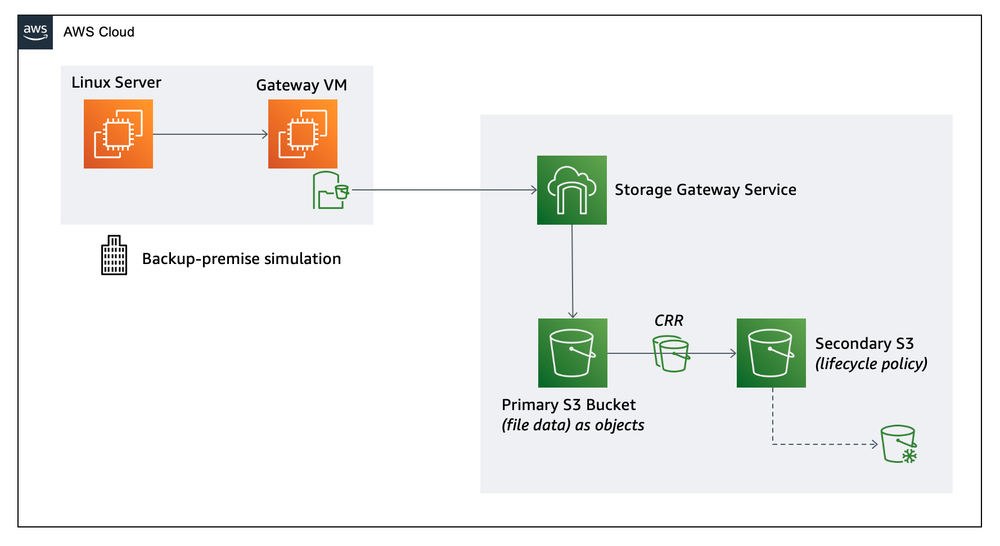

# AWS Hybrid Storage Workshop - Scenario 2 - File Gateway

## Prerequisites

### AWS Account

In order to complete this workshop, you will need an AWS account with access to create AWS IAM, S3, EC2, Storage Gateway and Cloud Formation.

Resources consumed as part of this workshop will have a cost and it is recommended that you follow the cleanup instructions once you have completed the workshop to remove all deployed resources and limit ongoing costs to your AWS account.

### Client Software

* **Browser** - We recommend that you use the latest version of Firefox or Chrome for this workshop.
* **SSH Client** -You will need an ssh client to access EC2 instances
* **AWS CLI** – You will need the aws cli installed on you client to access S3 objects
* **Key Pair** – You will need a valid EC2 Key Pair from the respective region. For the workshop, we have assigned the keypair for you. For more information on generating and downloading an EC2 Key Pair please visit [creating a key pair using amazon EC2](http://docs.aws.amazon.com/AWSEC2/latest/UserGuide/ec2-key-pairs.html#having-ec2-create-your-key-pair)

## Scenario 2 – File Gateway

In this scenario, you will configure AWS Storage Gateway to create an NFS connection from a Linux instance to an S3 bucket located in a remote region. This simulates AWS Storage Gateways ability to present an NFS mount point to a private datacenter, whilst storing any files written in S3 as durable objects in an S3 bucket of your choosing.

This scenario will also step you though configuring advanced S3 features S3 Lifecycle Policies and Cross Region Replication (CRR). Leveraging Lifecycle Policies can reduce the cost of storing objects, whilst CCR allows objects to be stored in multiple regions. 

Files that you write to the NFS interface in eu-west-1 will be accessible from the NFS mount point on your Linux instance and both a primary and secondary bucket in independent AWS regions.

In this scenario, you will leverage S3 buckets and features, AWS Storage Gateway (file mode), an EC2 Linux Instance, Security Groups and Cloud formation (to automate deployment of some components)

## Workshop Modules ###

This scenario is broken into 2 modules:

* **Module 1** - [Deploy source instance & configure S3 as Target Backup Storage Solution](module-1/README.md)
* **Module 2** - [Deploy Storage Gateway in File mode and integrate with S3](module-2/README.md)
* **Module 3 (Optional)** - [Configure S3 Storage Solution with Cross-Region Replication and Lifecycle Policy](module-3/README.md)

## License

This sample code is made available under the MIT-0 license. See the LICENSE file.

[Back to the main workshop scenarios page](../README.md)
