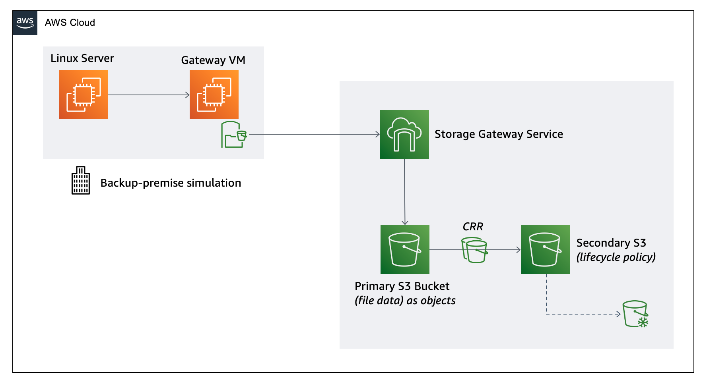
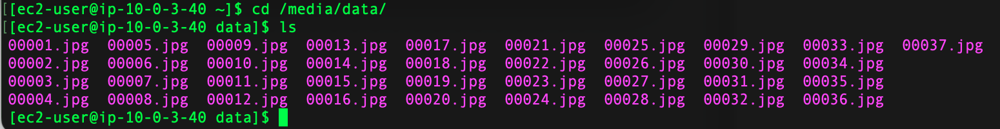
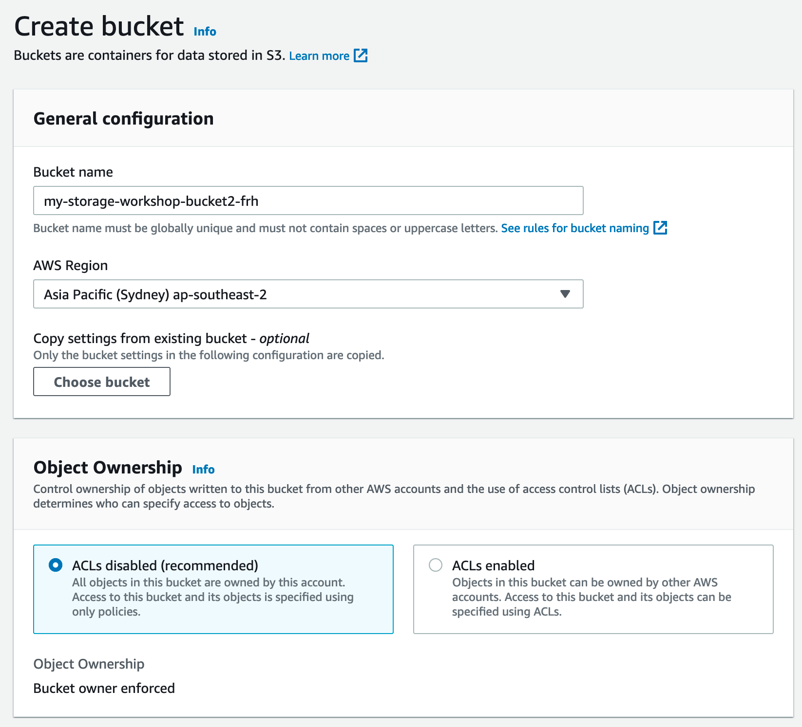
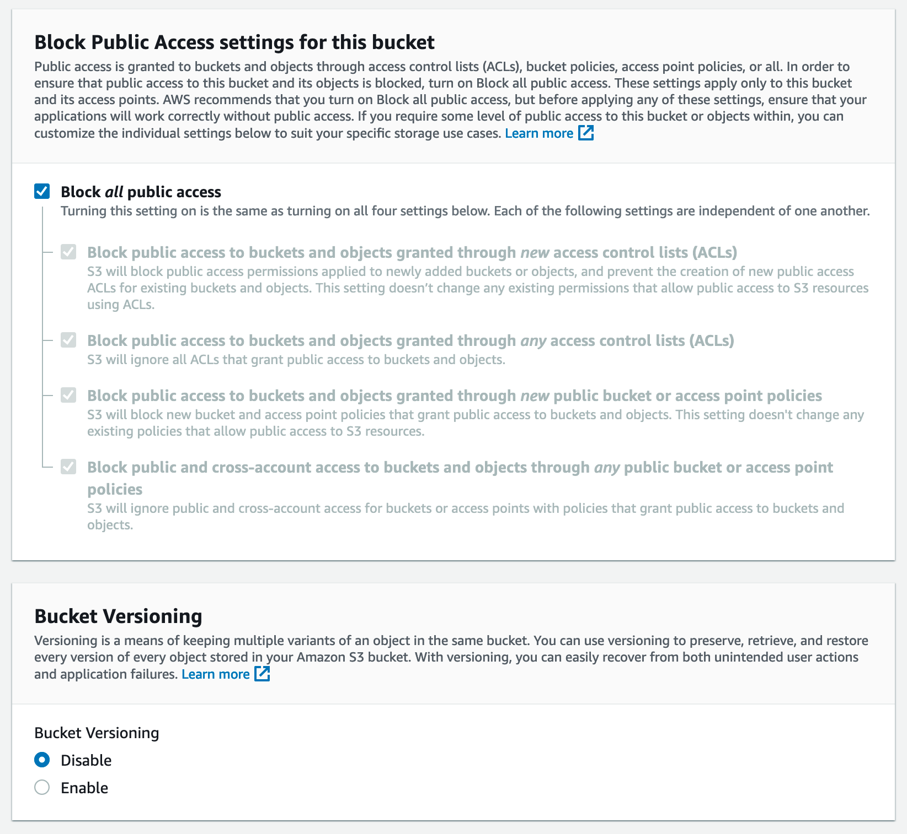
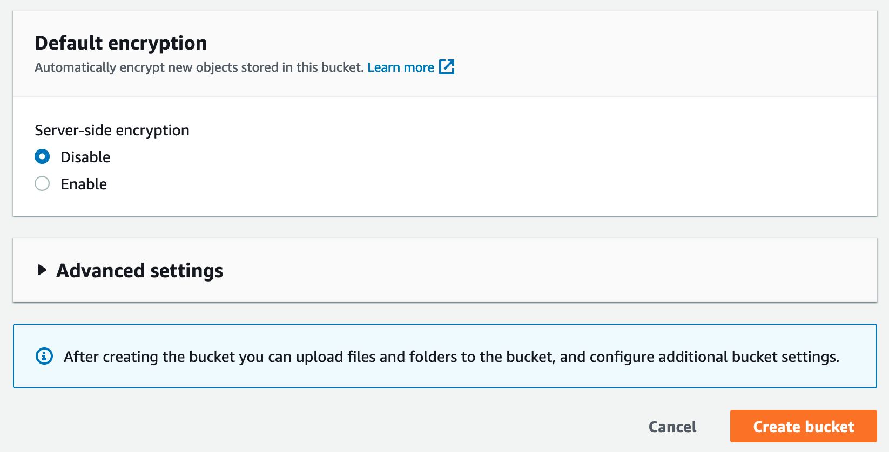

# Deploy Linux Instance & configure S3 as Storage Backup Target

## Introduction

In this module, you will deploy a Linux EC2 instance to simulate on-premises server with a root EBS volume with media data on it in the ap-southeast-1 (Singapore) AWS region. You will also create two S3 buckets in two different regions and configure advanced S3 features: S3 Lifecycle Policies and Cross Region Replication (CRR).

## Architecture Overview

The EC2 instance in ap-southeast-1 is to simulate the physical server in on-premises data center and will be used in next module to use an on-premises file storage gateway solution.  The EC2 instance use EBS volume as root volume with file data. 

S3 bucket for file gateway will be created in ap-southeast-1, which is the primary data backup location.

Optionally in Module-3, another S3 Bucket in ap-southeast-2 will be created as the replica copy of S3 file as part of a Data Recovery solution.  Cross-region replication will be enabled on the primary S3 bucket to replicate the same data to the replica S3 bucket.  Primary S3 bucket will be used in Module-2 as part of file storage gateway service. 

In addition, S3 lifecycle policy will be created to change the data older than 30 days in S3 replica bucket from S3 standard class to S3 Glacier class to save the cost.   

## Implementation Instructions

### 1.	Deploy Linux Instance using CloudFormation Template

The first step is to deploy an EC2 instance with some data in ap-southeast-1 to simulate a Linux server running in a non-AWS location.

You can launch a customized instance using the following AWS CloudFormation template in the ap-southeast-1. The template will launch an instance, download a sample dataset to the instance and setup a security group for ssh access.

<strong>CloudFormation Launch Instructions (expand for details)</strong>

1.	Right click the **Launch Stack** link below and "open in new tab"

Region| Launch
------|-----
Asia Pacific (Singapore) | 

2. Click **Next** on the Select Template page.
3. Select your default VPC and any one of the subnets within that vpc.  Note the subnet need to have a IGW attached.
4. If you already have an Access Key Pair for this region that you have access to, enter that key pair.  Otherwise, you will need to create a new key pair. [creating a key pair using amazon EC2](http://docs.aws.amazon.com/AWSEC2/latest/UserGuide/ec2-key-pairs.html#having-ec2-create-your-key-pair)
5. Leave the Allow SSH access from as 0.0.0.0/0 or enter the public IP of the computer from which you plan to access the Windows server.  You can find your public IP address at http://www.whatismypublicip.com/
6. Click **Next**.

7.	Click **Next** Again. (skipping IAM advanced section)
8.	On the Review page, check the box to acknowledge that CloudFormation will create IAM resources and click **Create**.

Once the Cloudformation Stack shows a status of *CREATE_COMPLETE*, you can continue to the next step.

Note: Instances that are launched as part of this CloudFormation template may be in the initializing state for few minutes.

### 2.	SSH into Linux Instance created earlier and List the data
SSH into the Linux instance that is just created, and list the files under /media/data. There are 200 JPEG files uploaded there. 

<strong>Step-by-step instructions (expand for details)</strong>

1. From the AWS Console, select EC2 in Services Tab, find the instance created by previous CloudFormation Stack.  The instance should have a name start with  “Hybrid Workshop – Deploy – Linux Server 1”. Write down the IPv4 Public IP in Description. 
2. Connect to the above Linux Instance. For detailed instruction, please refer to [Connecting to Your Linux Instance Using SSH](http://docs.aws.amazon.com/AWSEC2/latest/UserGuide/AccessingInstances.html)
3. In the Linux OS, type `cd /media/data`
4. Type `ls –l`, you should see 200 image files, which make up our sample data
  

### 3. Create first S3 buckets in ap-southeast-1 (Singapore)
Use the AWS console to create your primary S3 bucket located ap-southeast-1 (Singapore), a mock region simulating our target of backup storage.

<strong>Step-by-step instructions (expand for details)</strong>

1. Change the AWS console region to ap-southeast-1 (Singapore), by selecting **Asia Pacific (Singapore) ap-southeast-1** from the region list in the top right corner of the console.
2. In the AWS Management Console select **Services** then select **S3** under Storage.
3. Select **Create Bucket**
4. Provide a globally unique name for your bucket such as my-storage-workshop-bucket1-NAME.
5. Select the Region to **Asia Pacific (Singapore) ap-southeast-1**
6. Leave the rest of configuration as default (Object Ownership, Block Public Access, Bucket Versioning, Default Encryption)
  
  
  
7. Choose **Create** in the lower left of the dialog as a shortcut to create the bucket without advanced options.

## Implementation Validation
Using either the AWS Management Console or AWS Command Line Interface, copy a test file to the Amazon S3 primary bucket created in the section 3.
You can either upload it using the AWS Management Console, or you use the AWS CLI to copy it directly on:
`aws s3 cp YOU_LOCAL_FILE s3://YOUR_BUCKET_NAME_HERE`

Congratulations, you now have:
- a Linux instance in Singapore (ap-southeast-1), simulating your on-premise instance running storage backup
- a primary bucket in Singapore (ap-southeast-1), functioning as storage backup target.

When you are ready you can move to the second module.

Module 2: [Deploy Storage Gateway in File mode and integrate with S3](../module-2/README.md)

## License

This sample code is made available under the MIT-0 license. See the LICENSE file.

[Back to the main workshop scenarios page](../../README.md)
