# Deploy AWS Storage Gateway in File mode and integrate with S3

## Introduction

In this module, you’ll deploy AWS storage gateway in file mode in the same network as the the Linux instance created in module 1.  You will use AWS storage gateway’s ability to present an NFS mount point to a private data center and store files in AWS S3 in other regions, which is highly available and durable.

## Architecture Overview


The Linux EC2 instance created in Module-1 is to simulate the physical server in on-premises data center and a storage gateway is deployed on another EC2 instance to act as an on-premises file storage gateway.

The Linux EC2 instance use NFS mount to connect to the file gateway.  Media files are copied to file server, which actually store all files in AWS S3 bucket. Optionally, you can configure a cross region replication and lifecycle policy.

## Implementation Instructions

### 1. Deploy Storage Gateway Instance (on standby) using CloudFormation Template

In order to give our Linux instance access to S3 over NFS, we first need to deploy a storage gateway in the same region as the Linux instance. To do this, you can use the CloudFormation template below to kickstart the initial instance creation process. You will be setting up the rest of storage gateway configuration to get familiarize with the functionality and its environment.

<details>
<summary><strong>CloudFormation Launch Instructions (expand for details)</strong></summary><p>

1.	Right click the **Launch Stack** link below and "open in new tab"

Region| Launch
------|-----
Asia Pacific (Singapore) | [](https://console.aws.amazon.com/cloudformation/home?region=ap-southeast-1#/stacks/new?stackName=storage-workshop-2b&templateURL=https://felixcfn.s3.eu-west-1.amazonaws.com/scenario2-step2-migrate-FGW1-FR.json)

2.  Click **Next** on the Select Template page.
3.	Select the VPC and subnet where the Linux instance was created in Module-1
4.	Select the security group that start with "storage-workshop-2a-linux1SecurityGroup" (This will allow the Linux instance network access to the storage gateway instance)
5.	Click **Next**.
  
  

6.	Click **Next** Again. (skipping "Configure stack options" section, leaving all configuration in this section as default)

  
  
7.	On the Review page, check the box to acknowledge that CloudFormation will create IAM resources and click **Create Stack**.

  
  
Once the CloudFormation stack shows a status of CREATE_COMPLETE, you are ready to move on to the next step2

Note: it may take some time for the gateway to activate. You can see the activation status of the gateway in the Name of the EC2 instance in ap-southeast-1

</p></details>

### 2. Configure storage Gateway in ap-southeast-1 region

From the AWS Management Console, select **Storage Gateway** from within services and select Asia Pacific (Singapore) as the region. You should see a storage gateway console where you will create the service.


<details>
<summary><strong>Step-by-Step Instructions</strong></summary><p>

- From Storage Gateway console, choose **Gateway** from left sidebar, then click on **Create gateway**
  
  
  
- **Set up Gateway** - choose desirable Gateway name.
  
  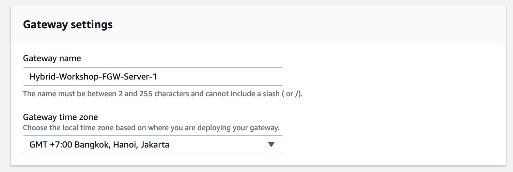
  
- **Gateway options** - Choose Amazon S3 File Gateway as you want to deploy the Storage Gateway as the core backup service.
  
  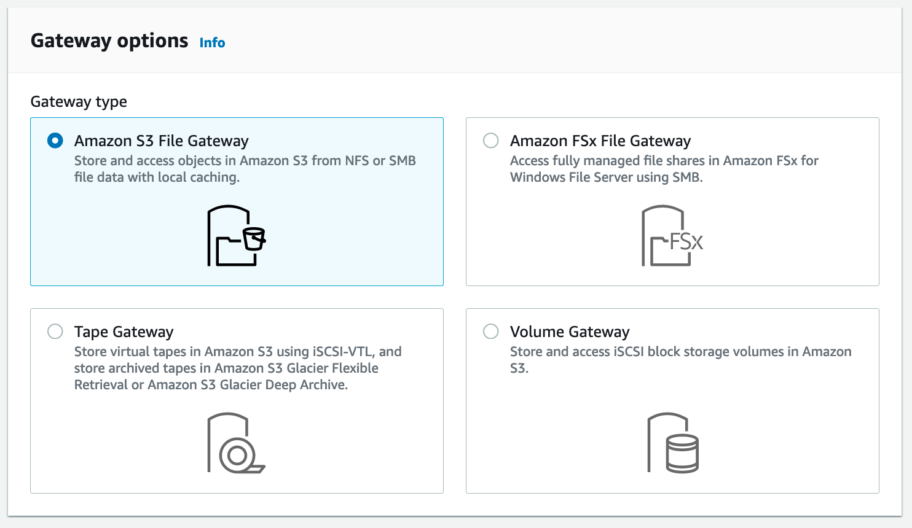

- **Platform options** - choose **Amazon EC2** as the platform of choice, functioning as the file geiifccuhckateway instance.
  In this case, we have created the EC2 instance from the CloudFormation template to simulate the storage gateway to be running on Amazon EC2. in actual production environment, you have the option to deploy this from VMware ESXi, Microsoft Hyper-V, Linux KVM, or hardware appliance, based on your actual requirements and objective.
  
- Acknowledge the steps information that you are able to access the EC2 instance, then click on **Next**
  
  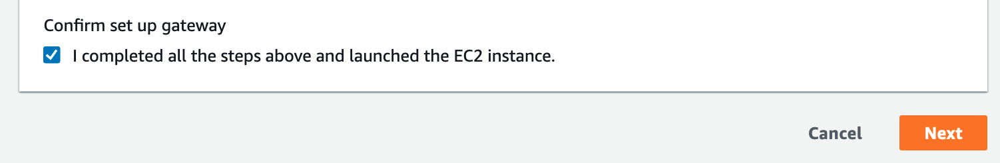

- **Connect to AWS** - Choose **Publicly accessible** as the service endpoint type, as we want to access it in the closed-lab environment. In actual production environment, you have the option to use VPC hosted service endpoint as the choice. 
  
- **Gateway connection options** - choose IP address as the connection options, since we need to access the storage gateway in this environment from the public IP. In actual production environment, you have the option to connect using activation key which can be retrieved by accessing the private IP address.
  
- Enter the public IP address of File Gateway instance. This can be retrieved from the EC2 console under Details section. Click on **Next** once done entering.
  
  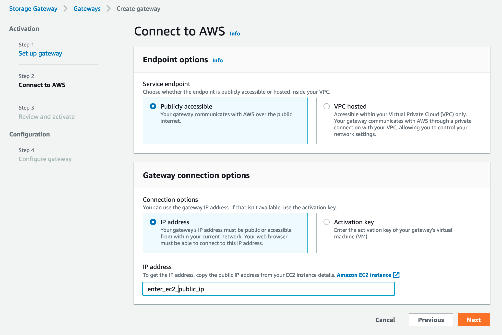
  
- **Review and Activate** - Storage Gateway will now attempt to establish connection to the assigned EC2 instance. Review the information captured, and then click **Next**
  
  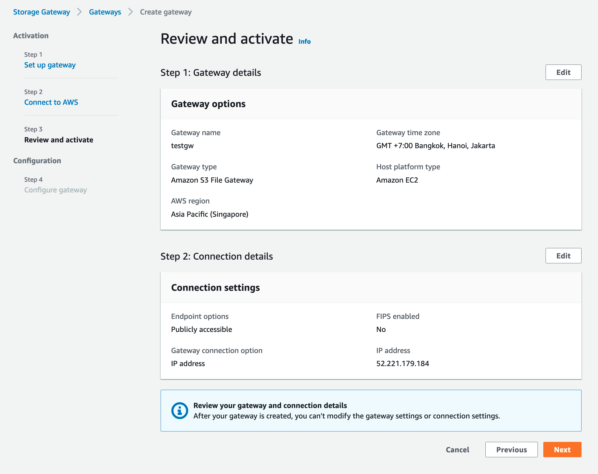

- At this point, storage gateway will proceed with detecting and configuring cache storage. The recommended minimum capacity for cache is 150 GiB, as indicated. Allocate this storage as **Cache** from the dropdown box.
  
  Choose *Create a new log group* under **CloudWatch log group** configuration section.

  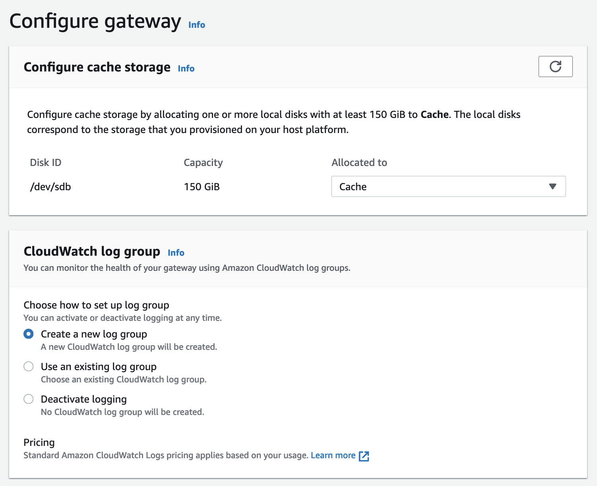
  
  Under CloudWatch alarms, choose as **Deactivated alarm**.
  Review the config, then click **Configure**
  
  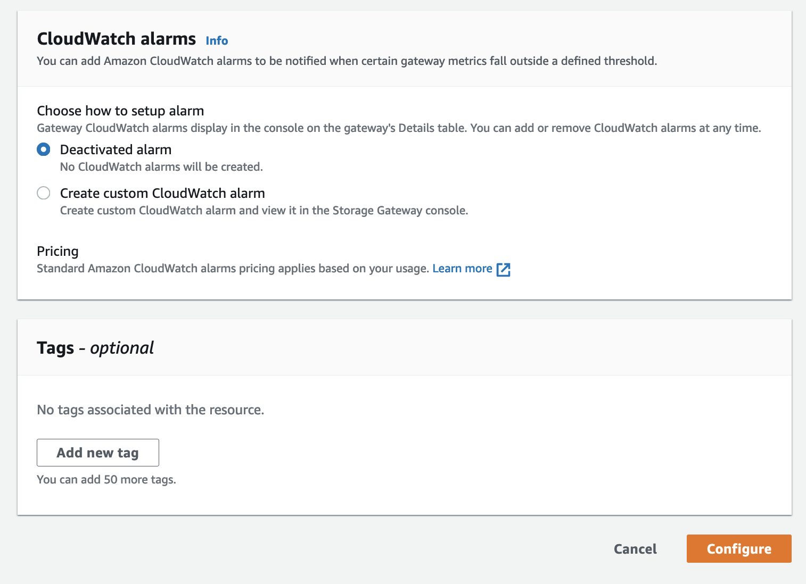
  
  Back to the Storage Gateway console, File Storage Gateway is now created and running.
  
  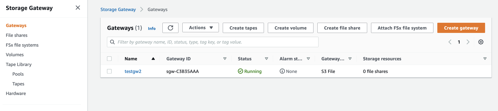
  
</p></details>

### 3. Create a file share connected to your primary S3 bucket

A file share can be created on the storage gateway to be used by NFS client. The file share also connects to the S3 bucket where the data is actually stored in the form of objects. Unix file permissions for each file and folder are stored as object metadata within objects in S3.

<details>
<summary><strong>Step-by-step instructions (expand for details)</strong></summary><p>

-	Select the gateway you created earlier, then click **Create file share**.
  
  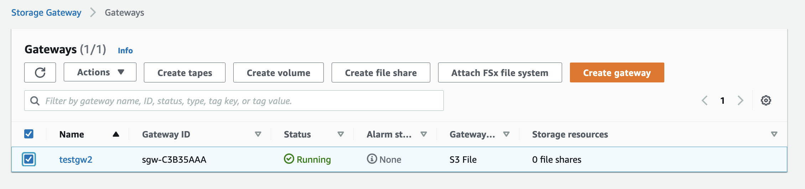

-	Select the gateway that you created earlier from dropdown box, choose “S3 bucket name” as the Amazon S3 location. Then, fill in Amazon S3 bucket name field with the S3 bucket name that you created earlier (leave optional S3 prefix empty for now).

- Choose AWS region as **Asia Pacific (Singapore) ap-southeast-1** from the dropdown box.

- Under **File share name**, leave as default.

  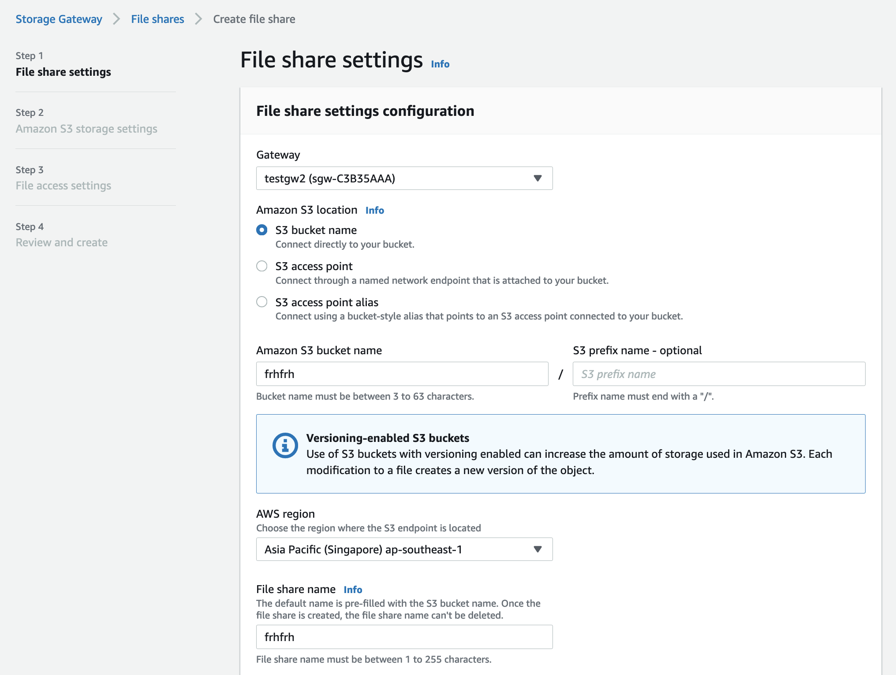

- Leave rest of configuration section as default - **untick** Private Link for S3, Access Objects with **NFS**, **Deactivate logging** for Audit logs, **None** for automated cache refresh from S3, **None** for File upload notification

  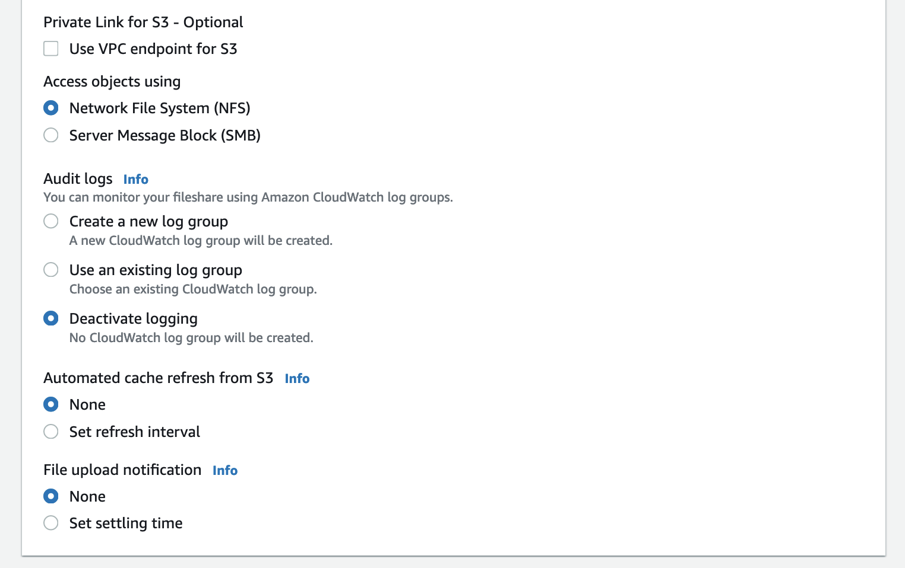

- On Amazon S3 storage settings, keep as default, then click **Next**
  
  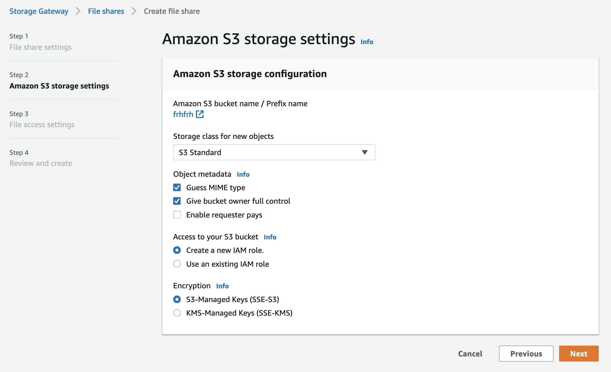
  
- In *File access settings* - enter **0.0.0.0/0** as the *Allowed clients*, remember this is good only for the workshop duration. In actual production environment, you need to specify the object addresses.
  
  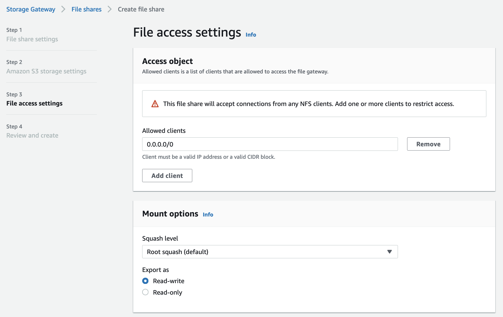
  
- Keep the rest settings as default, then click on **Next**
  
  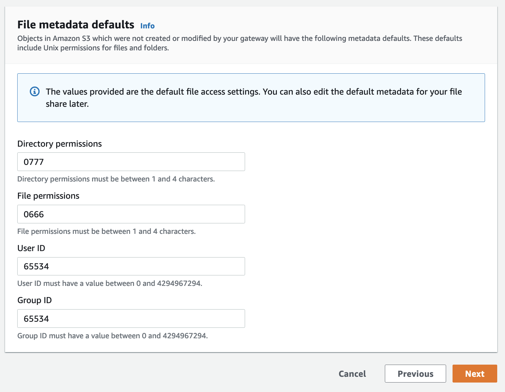
  
- Review config, then click on **Next**
- Validate File Shares have been created, as below illustrated from console.
  
  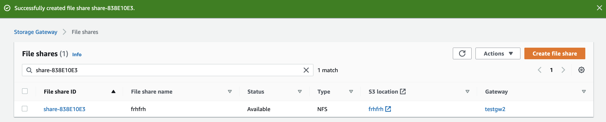
  
After your file share is created, you can select the share see your file share settings in the file share Details pane at the bottom of the console.
</p></details>


### 4. Mount the bucket over NFS on your Linux instance

At this point, you can mount the file share on the Linux NFS client and gain access to the associated S3 bucket.

<details>
<summary><strong>Step-by-step instructions (expand for details)</strong></summary><p>

1.	SSH into the Linux Instance created in module 1
2.	Create the directory that will contain the NFS shared files

`sudo mkdir -p /mnt/nfs/s3`

3.	Mount your file share, the mount command can be found from

`# sudo mount -t nfs -o nolock [Your gateway VM IP address]:/[mount path on your client] [MountPath]`

Example
`sudo mount -t nfs -o nolock 172.31.10.98:/my-storage-workshop-bucket1 /mnt/nfs/s3`

4.	Check the directory has been mounted using df or mount command

```
df –h
mount
```

Example output:

```
[ec2-user@ip-172-31-11-236 data]$ df -h
Filesystem                                 Size  Used Avail Use% Mounted on
devtmpfs                                   488M   60K  488M   1% /dev
tmpfs                                      497M     0  497M   0% /dev/shm
/dev/xvda1                                 7.8G  1.1G  6.7G  14% /
172.31.10.98:/my-storage-workshop-bucket1  8.0E     0  8.0E   0% /mnt/nfs/s3
```

</p></details>

### 5. Copy data from EBS on Linux to the mounted file share
In this module, we will use the Linux instance created in module 1 as NFS client and copy our sample data to S3 using standard linux commands.

<details>
<summary><strong>Step-by-step instructions (expand for details)</strong></summary><p>

1. In Linux test instance, copy media file to file gateway

```
cd /media/data/
cp -v *.jpg /mnt/nfs/s3/
```
</p></details>

## Implementation Validation
### 1. Access the content in the primary S3 bucket

<details>
<summary><strong>Step-by-step instructions (expand for details)</strong></summary><p>

- In the Amazon S3 management console, navigate to your primary bucket and check to see that the 200 images files are stored as objects within.

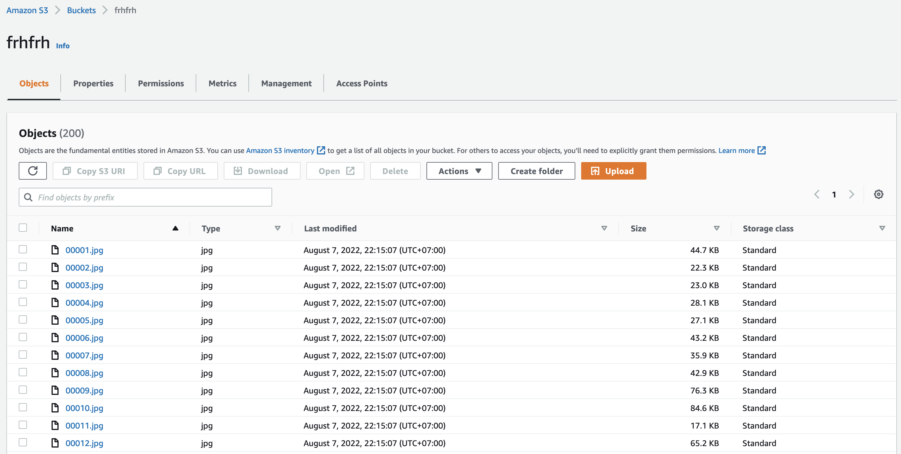
</p></details>

## Scenario complete

Congratulation you have completed the second scenario. In this workshop you successfully copied data from an nfs client to a primary S3 bucket in ap-southeast-1. Additionally, objects written in the primary bucket have the option to be replicated to a secondary bucket (for example: other region). These objects can also be be life cycled to glacier after 30 days and in the real world might be kept to safeguard against accidental deletions that may occur the the primary objects in the primary S3 bucket.

## Workshop Cleanup

To make sure all resources are deleted after this workshop scenario make sure you execute the follow steps in the order outlined below:

1. Delete the AWS file gateway from the storage gateway console
2. Delete the buckets
3. Destroy the cloud formation stack "storage-workshop-2b" (wait for it to complete before deleting the next one)
4. Destroy the cloud formation stack "storage-workshop-2a"

## License

This sample code is made available under the MIT-0 license. See the LICENSE file.

[Back to the main workshop scenarios page](../../README.md)
