# Configure S3 Storage with Cross-Region Replication and Lifecycle Policy

### Step 1. Create secondary S3 bucket in Sydney (ap-southeast-2)
Use the AWS console to create a secondary S3 bucket in a secondary region (ap-southeast-2)

<strong>Step-by-step instructions (expand for details)</strong>

- In the AWS Management Console select **Services** then select **S3** under Storage.
- Select **+Create Bucket**
- Provide a globally unique name for your bucket such as my-storage-workshop-bucket2.
- Select the Region to Asia Pacific (Sydney)
- **Object Ownership** - Choose ACLs disabled

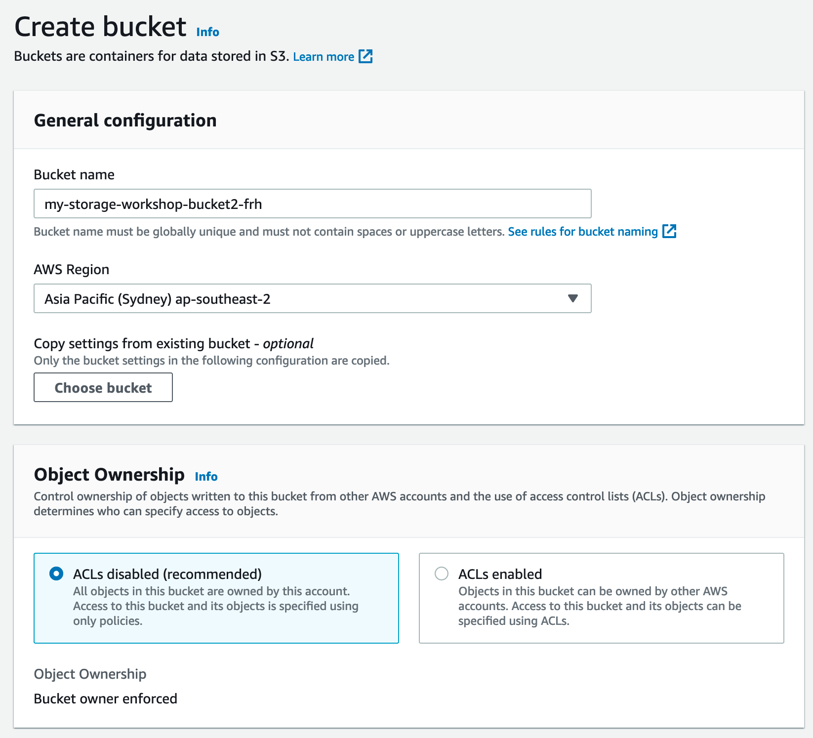

- **Block Public Access settings for this bucket** - tick *Block all public access*
- **Bucket Versioning** - Choose Disable

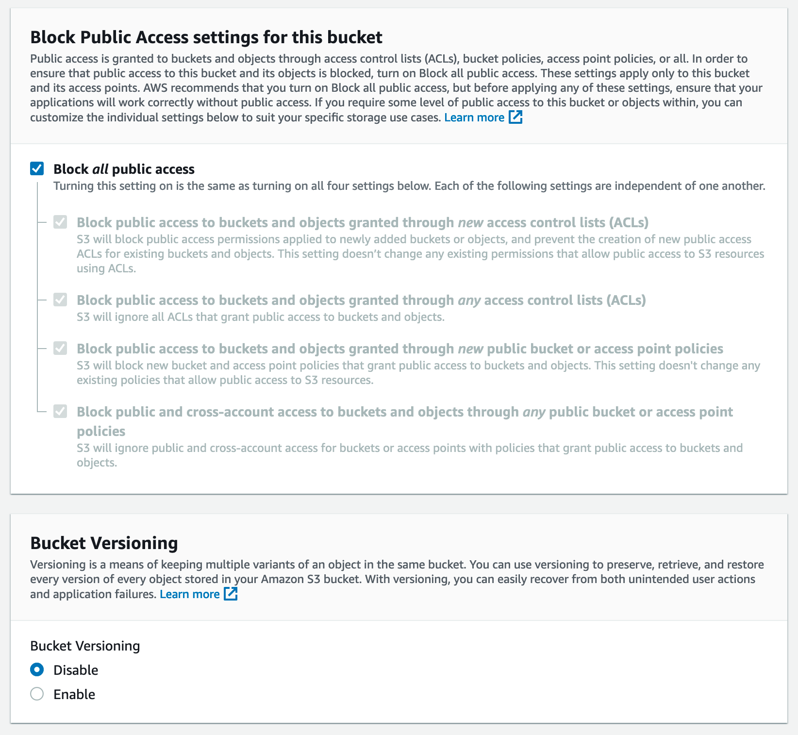

- **Default encryption** - Choose Disable
- Review your selection again, then Click on **Create bucket** button in the bottom of the dialog.

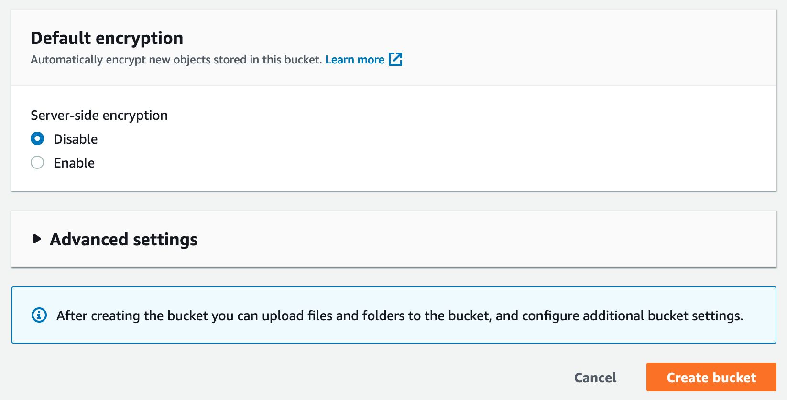

### Step 2. Setup Cross-region Replication from S3 Primary bucket to the secondary S3 bucket
Use the AWS console to enable cross-region replication on S3 primary bucket to S3 secondary bucket in another region.

<strong>Step-by-step instructions (expand for details)</strong>

- In AWS Management Console, S3 service, all the buckets are listed. Click the name of the S3 bucket you created in Step 3.
- Click *Management Tab*, then scroll down to *Replication rules* section, then click on **Create replication rule**

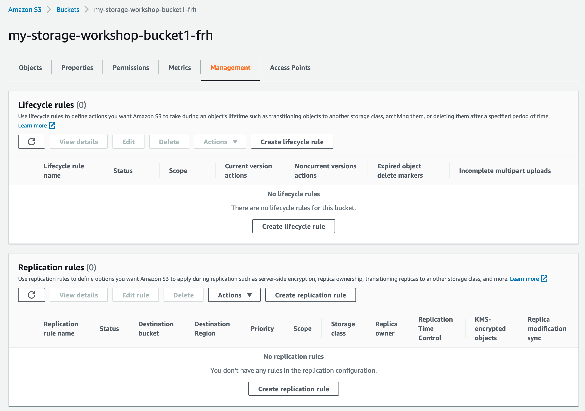

- Enter desired *Replication rule name** in the field,
- For *Status*: Choose *Enabled*
- Under **Source bucket**, review your selected Source bucket name (it should show your primary bucket, which was created earlier in Module-1 and source region in Singapore)
- On *Choose a rule scope*, choose **Apply to all objects in the bucket**

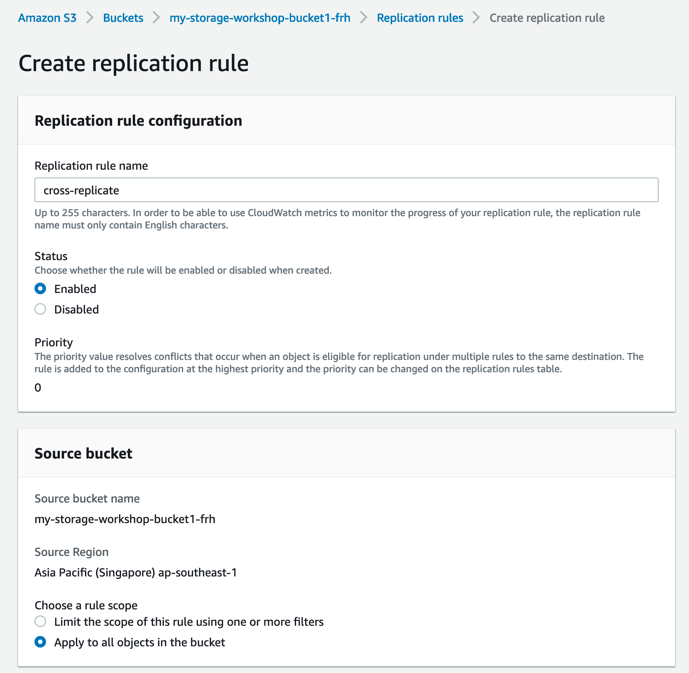

Note: **Enable Versioning** on the bucket when asked, leave the KMS encryption uncheck in this case.

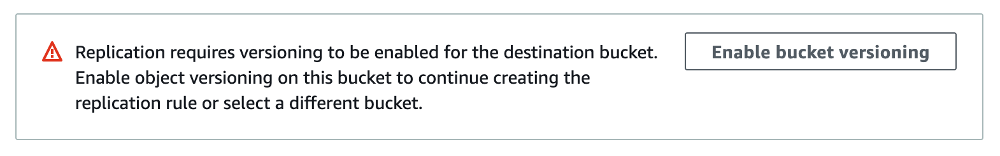

- Now under **Destination**, specify *Choose a bucket in this account* since we want to utilize existing bucket which is already used for Storage File Gateway service so it can automatically replicate to secondary bucket.
- In *Bucket name*, choose the bucket that will receive the replicated objects, which is your recently created bucket in the Sydney region from step-1 above.
- Enable Versioning when asked.
- Now we want to create new IAM role for the service to allow cross-replicate action. Under *IAM Role*, Choose existing IAM roles, then choose **Create new role** (the GUI contradicts the action we want to do, hopefully this will get fixed in future update).

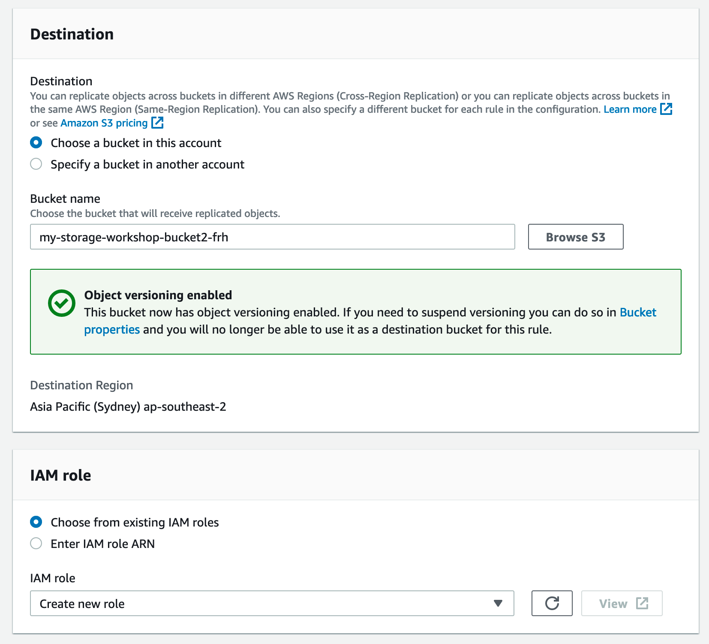

- **Replicate existing objects** - You can enable replicate existing objects, by choosing *Yes*. If you want to do it, then you need to do a one-time batch operations job from the replication configuration to replication objects that already exist in the bucket and to synchronize source and destination buckets.

-	Review your selection, then click on **Submit** button.

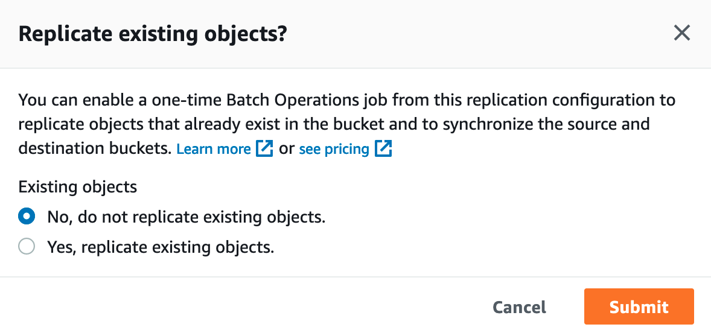

### Step 3. Setup S3 Lifecycle Policy on S3 secondary bucket
Use the AWS Management Console to create a new lifecycle policy on S3 secondary bucket to transition and move old data to Glacier.

<strong>Step-by-step instructions (expand for details)</strong>

- In AWS Management Console, S3 service, all the buckets are listed. Click the name of  the S3 secondary bucket in Sydney Region you created in Step 1.
- Click Management Tab, and go to *Lifecycle rules* section
- Click **+Create lifecycle rule** button

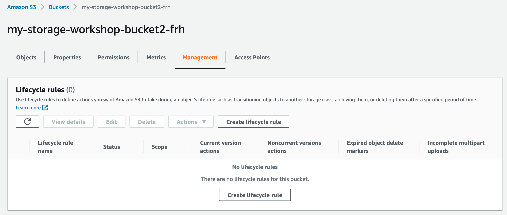

- In the first step of *Create lifecycle rule* Window, enter a rule name
- Choose rule scope to *Apply to all objects in the bucket*, tick on Acknowledge.

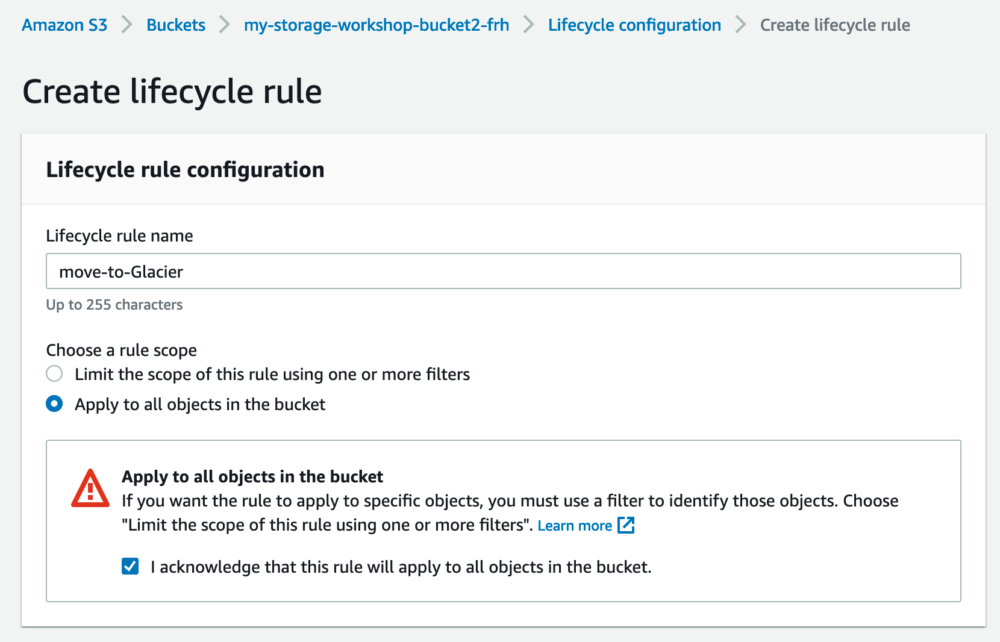

- **Lifecycle rule actions** -  tick on *Move current versions of objects between storage classes*

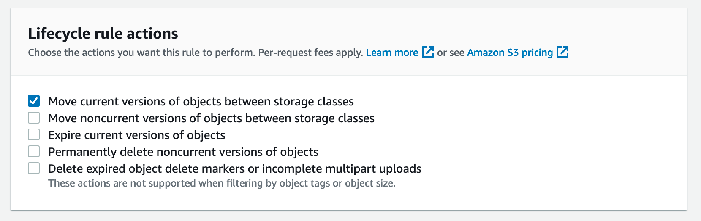

- **Transition current versions of objects between storage classes** - choose *Glacier Flexible Retrieval* as the storage class transitions, enter "30" for *Days after object creation* as we want to move old data and transition its class to Glacier for archiving purpose. Tick on acknowledgement notice.

Review the transition and expiration actions, then click on **Create rule** button

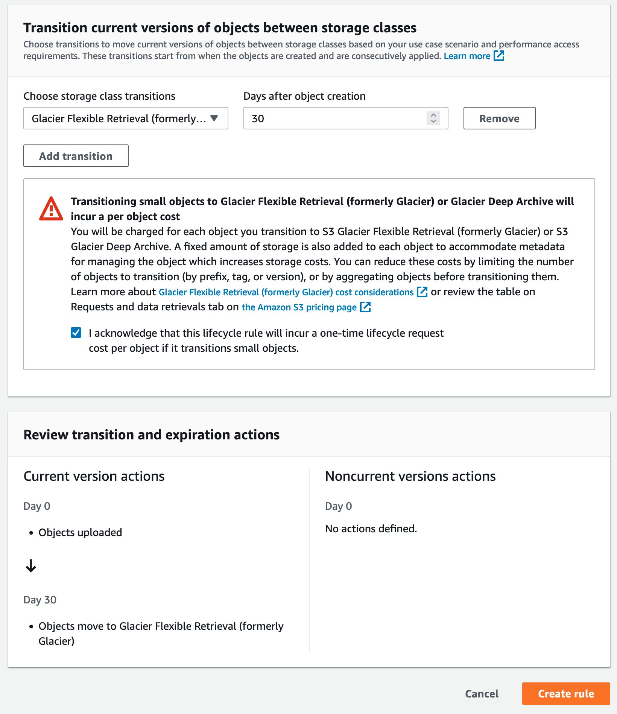

## Implementation Validation
- Select the S3 secondary bucket created in Step 1 after a few minutes.  Click the refresh button, you should see the same file replicated to the second bucket.

### Verify S3 Cross Region Replication is replicating objects to the secondary S3 bucket
- In  the Amazon S3 management console, view the content under S3 replica bucket. It should display the same 200 JPEG files in the region of Asia Pacific (Sydney).
